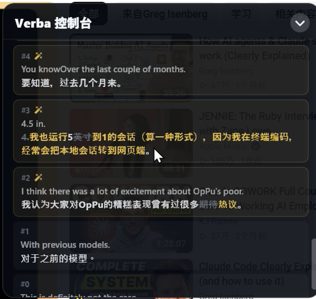
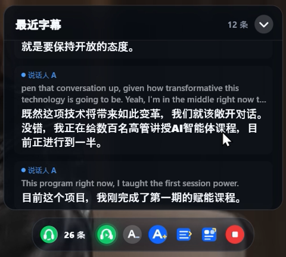
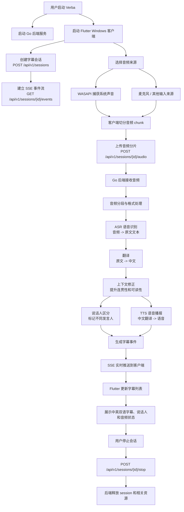

# Verba

Verba 是一个面向 Windows 桌面端的 AI 实时双语字幕助手。它通过 WASAPI 捕获系统音频，将音频实时上传到 Go 后端，由后端完成语音识别、英文转写、中文翻译和字幕事件推送。前端基于 Flutter 构建，负责展示实时双语字幕和音频状态。项目目标是帮助用户在观看英文视频、在线会议、课程和直播时，获得低延迟、可读性强的中英文字幕体验。


## 视频链接
【Verba 同传-哔哩哔哩】 https://b23.tv/fe3d7af


## 功能
- Windows 系统音频捕获：不用麦克风外放，直接抓取电脑播放声音
- 实时双语字幕：英文转写 + 中文翻译同步展示 + 中文语言播放
- 翻译修正：对上下文进行二次修正，提高字幕连贯性


- 说话人区分：支持区分不同发言人




## 截图


## 工作流程



整体链路可以理解为：客户端负责采集音频、上传分片和展示字幕；后端负责会话管理、音频处理、AI 调用、字幕事件生成和 SSE 推送。这样前端可以保持轻量，核心 AI 流水线集中在 Go 后端中维护。

## 项目结构

```text
Verba/
|- client/                         Flutter Windows 桌面客户端
|  |- lib/
|  |  |- main.dart                  应用入口
|  |  |- models/                    字幕等数据模型
|  |  |- pages/                     页面
|  |  |- providers/                 Riverpod 状态管理
|  |  |- services/                  API、SSE、WASAPI、TTS 客户端
|  |  |- theme/                     主题样式
|  |  |- utils/                     通用工具
|  |  `- widgets/                   字幕、音量条、悬浮窗等组件
|  |- test/                         Flutter 测试
|  |- assets/icons/                 应用图标资源
|  `- windows/
|     |- runner/                    Windows 桌面壳
|     `- wasapi/                    WASAPI loopback 音频捕获 DLL
|
|- server/                         Go 后端 API、AI 流水线和 SSE 服务
|  |- cmd/verba/main.go             后端入口和路由
|  |- internal/
|  |  |- audio/                     音频分片、分段和 WAV 处理
|  |  |- config/                    环境变量和配置加载
|  |  |- diarization/               说话人区分服务适配
|  |  |- pipeline/                  ASR、翻译、修正和音频上传流水线
|  |  |- session/                   会话生命周期管理
|  |  |- sse/                       SSE 事件广播
|  |  `- tts/                       实时 TTS 分句、播放和 DashScope 适配
|  |- .env.example                  后端环境变量示例
|  `- go.mod                        Go 模块定义
|
|- docs/                           产品、设计、计划、质量、安全和可靠性文档
|  |- product-specs/                需求文档
|  |- design-docs/                  设计方案和流程图
|  |- exec-plans/                   执行计划和技术债跟踪
|  |- generated/                    生成类技术文档
|  `- references/                   外部参考资料
|
|- AGENTS.md                       AI / 开发协作规范
|- ARCHITECTURE.md                 项目整体架构说明
|- 启动Verba.bat                   Windows 一键启动脚本
`- README.md                       项目介绍、配置、运行和测试说明
```

技术栈：

- 客户端：Flutter、Riverpod、Windows WASAPI
- 后端：Go 标准库 HTTP 服务
- 实时推送：SSE（Server-Sent Events）
- AI 服务：SiliconFlow 兼容接口，通过 `server/.env` 配置

## 环境要求

- Windows 10 或更新版本
- Flutter 3.44 或更新版本
- Go 1.25 或更新版本
- SiliconFlow API Key（需要真实 ASR / 翻译调用时必填）

检查本机环境：

```powershell
flutter --version
go version
```

## 后端配置

先复制环境变量文件：

```powershell
Set-Location D:\wc\Verba\server
Copy-Item .env.example .env
notepad .env
```

至少需要配置：

```env
SILICONFLOW_API_KEY=sk-your-key-here
```

可选配置：

```env
VERBA_PORT=8080
VERBA_ASR_MODEL=FunAudioLLM/SenseVoiceSmall
VERBA_TRANSLATE_MODEL=deepseek-ai/DeepSeek-V3
SILICONFLOW_BASE_URL=https://api.siliconflow.cn/v1
```

注意：客户端当前写死访问 `http://localhost:8080`。如果修改后端端口，也需要同步修改 `client/lib/providers/session_provider.dart` 里的 `baseUrl`。

## 运行项目

先启动后端：

```powershell
Set-Location D:\wc\Verba\server
go run .\cmd\verba
```

也可以运行已有的编译产物：

```powershell
Set-Location D:\wc\Verba\server
.\verba.exe
```

再打开另一个 PowerShell 窗口，启动 Flutter Windows 客户端：

```powershell
Set-Location D:\wc\Verba\client
flutter run -d windows
```

这个项目是 Windows 桌面应用，不支持 Flutter Web。原因是客户端使用了 `dart:ffi` 和 Windows WASAPI 相关代码。


## 测试和构建

运行后端测试：

```powershell
Set-Location D:\wc\Verba\server
go test .\internal\... -v -count=1
```

运行前端测试：

```powershell
Set-Location D:\wc\Verba\client
flutter test
```

构建后端：

```powershell
Set-Location D:\wc\Verba\server
go build .\cmd\verba
```

构建 Windows 客户端：

```powershell
Set-Location D:\wc\Verba\client
flutter build windows --debug
```


