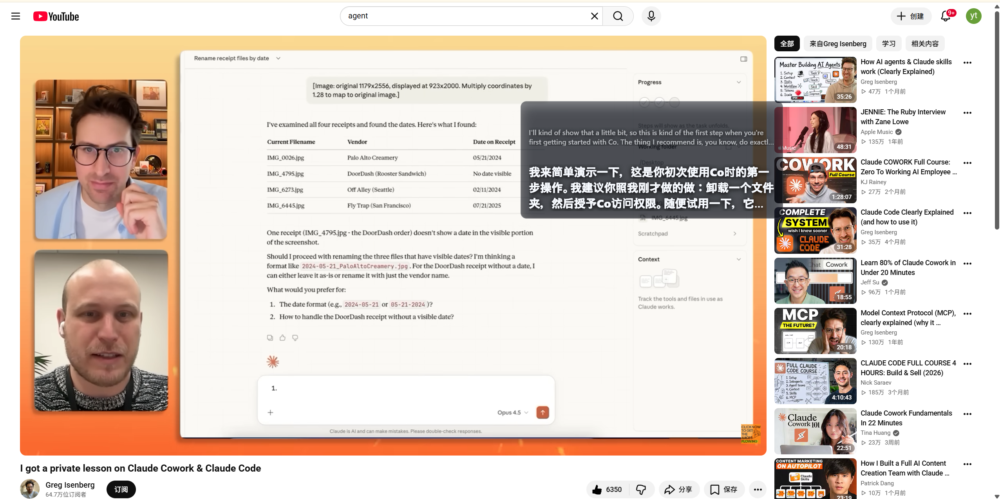

# Verba

Verba 是一个面向 Windows 桌面的 AI 实时双语字幕助手。它通过 WASAPI 捕获系统音频，把音频分片上传到 Go 后端，再由后端完成语音识别、翻译和修正，并通过 SSE 把字幕结果推送回 Flutter 客户端。



## 项目结构

```text
Verba/
|- client/    Flutter Windows 桌面客户端
|- server/    Go 后端 API 和 SSE 服务
|- docs/      产品、设计、API 和测试说明
|- CLAUDE.md  开发规范
`- README.md  项目运行说明
```

技术栈：

- 客户端：Flutter、Riverpod、Windows WASAPI
- 后端：Go 标准库 HTTP 服务
- 实时推送：SSE（Server-Sent Events）
- AI 服务：SiliconFlow 兼容接口，通过 `server/.env` 配置

## 环境要求

- Windows 10 或更新版本
- Flutter 3.44 或更新版本
- Go 1.25 或更新版本
- SiliconFlow API Key（需要真实 ASR / 翻译调用时必填）

检查本机环境：

```powershell
flutter --version
go version
```

## 后端配置

先复制环境变量文件：

```powershell
Set-Location D:\wc\Verba\server
Copy-Item .env.example .env
notepad .env
```

至少需要配置：

```env
SILICONFLOW_API_KEY=sk-your-key-here
```

可选配置：

```env
VERBA_PORT=8080
VERBA_ASR_MODEL=FunAudioLLM/SenseVoiceSmall
VERBA_TRANSLATE_MODEL=deepseek-ai/DeepSeek-V3
SILICONFLOW_BASE_URL=https://api.siliconflow.cn/v1
```

注意：客户端当前写死访问 `http://localhost:8080`。如果修改后端端口，也需要同步修改 `client/lib/providers/session_provider.dart` 里的 `baseUrl`。

## 运行项目

先启动后端：

```powershell
Set-Location D:\wc\Verba\server
go run .\cmd\verba
```

也可以运行已有的编译产物：

```powershell
Set-Location D:\wc\Verba\server
.\verba.exe
```

再打开另一个 PowerShell 窗口，启动 Flutter Windows 客户端：

```powershell
Set-Location D:\wc\Verba\client
flutter run -d windows
```

这个项目是 Windows 桌面应用，不支持 Flutter Web。原因是客户端使用了 `dart:ffi` 和 Windows WASAPI 相关代码。

## 验证后端是否正常

后端启动后默认监听：

```text
http://localhost:8080
```

可以创建一个测试 session：

```powershell
Invoke-RestMethod `
  -Method Post `
  -Uri "http://localhost:8080/api/v1/sessions" `
  -ContentType "application/json" `
  -Body "{}"
```

正常情况下会返回：

```json
{
  "session_id": "sess_..."
}
```

## API 概览

- `POST /api/v1/sessions`：创建会话
- `POST /api/v1/sessions/{sessionId}/audio`：上传音频分片
- `GET /api/v1/sessions/{sessionId}/events`：建立 SSE 字幕事件流
- `POST /api/v1/sessions/{sessionId}/stop`：停止会话

## 测试和构建

运行后端测试：

```powershell
Set-Location D:\wc\Verba\server
go test .\internal\... -v -count=1
```

运行前端测试：

```powershell
Set-Location D:\wc\Verba\client
flutter test
```

构建后端：

```powershell
Set-Location D:\wc\Verba\server
go build .\cmd\verba
```

构建 Windows 客户端：

```powershell
Set-Location D:\wc\Verba\client
flutter build windows --debug
```

## 停止项目

如果后端和客户端都在运行，可以用：

```powershell
Stop-Process -Name verba_app,verba -ErrorAction SilentlyContinue
```

如果客户端是通过 `flutter run -d windows` 启动的，也可以在对应终端里按 `q` 退出。

## 常见问题

### 8080 端口被占用

查看占用进程：

```powershell
Get-NetTCPConnection -LocalPort 8080 -ErrorAction SilentlyContinue |
  Select-Object LocalAddress,LocalPort,State,OwningProcess
```

可以停止占用端口的进程，或者修改 `VERBA_PORT`。如果修改端口，记得同步修改客户端 `baseUrl`。

### Flutter Web 报 `dart:ffi is not available`

这是预期现象。请运行 Windows 桌面端：

```powershell
flutter run -d windows
```

